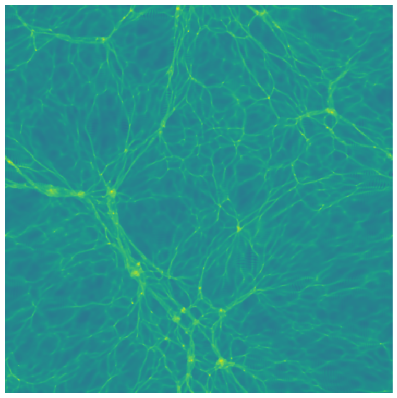
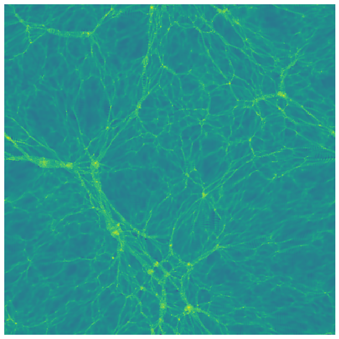

# cosmoSR

A Python package for training neural networks to super-resolve gridded cosmological simulations.

## Motivation

Running cosmological simulations at high resolution across a large volume is computationally prohibitive. `cosmoSR` addresses this by learning the mapping from low-resolution to high-resolution density fields using a pair of small reference simulations — then applying that mapping to a large, affordable low-resolution box.

The workflow is:

1. Run the large low-resolution simulation box you need.
2. Run two small boxes at matched resolution: one at low resolution and one at high resolution.
3. Generate a training sample from the small boxes using this toolkit.
4. Train a neural network to predict the high-resolution structure from the low-resolution input.
5. Apply the trained network to the full large box.

Here is an example of 2D-projected results:

| Low resolution | Super resolution | High resolution |
|:-:|:-:|:-:|
|  |  |  |

## Installation

```bash
git clone https://github.com/IvanKostyuk94/SuperResolution.git
cd SuperResolution
pip install .
```

**Requirements:** Python ≥ 3.7, TensorFlow, NumPy.

## Quick start

1. Copy the `run/` directory to your working directory.
2. Place your low- and high-resolution simulation data in `input_data/`.
3. Edit `config.py` to match your data paths and training parameters.
4. Run the pipeline:

```bash
python run.py
```

The trained network weights will be saved to your configured output directory.

## Repository layout

```
cosmoSR/
├── run/                  # Copy this to each new training directory
│   └── config.py         # All user-facing parameters live here
├── src/
│   ├── networks/         # Neural network architectures (one module per model)
│   ├── loss/             # Loss functions (one module per model, e.g. generator + critic for a GAN)
│   ├── building_blocks/  # Classes that assemble networks, optimizers, and losses into a trainable model
│   ├── network_trainer.py# Top-level trainer that wires the building blocks together
│   └── utils.py          # Helpers for data preparation and run management
├── images/               # Example images used in this README
└── deprecated/           # Old code retained for reference only
```

## License

GPL-3.0 — see [LICENSE](LICENSE).
